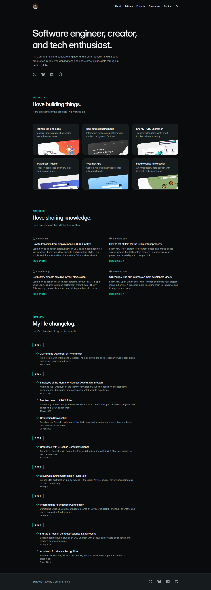

# Personal site

A modern, developer-focused personal site showcasing my **projects**, **blog posts** (powered by **MDX**), and **bookmarks** — all built with a strong focus on **performance**, **accessibility**, and **design**.

---

## Table of Contents

- [Overview](#overview)
  - [Features](#features)
  - [Screenshot](#screenshot)
  - [Links](#links)
- [My Process](#my-process)
  - [Built With](#built-with)
  - [What I Learned](#what-i-learned)
  - [Continued Development](#continued-development)
  - [Getting Started](#-getting-started)
  - [Useful Resources](#useful-resources)
- [Author](#author)
- [Acknowledgments](#acknowledgments)

---

## Overview

### Features

This site allows users to:

- Explore the site in **light and dark mode** (system preference)
- Read **blog posts** written in **MDX format** with syntax highlighting
- Browse **projects** with descriptions and live links
- Explore a **curated list of development resources** (Bookmarks)

### Screenshot



### Links

- **Live Site:** [gshukla.in](https://gshukla.in)
- **Repository:** [https://github.com/heygauravshukla/gshukla.in](https://github.com/heygauravshukla/gshukla.in)

---

## My Process

### Built With

- **Semantic TSX markup** & mobile-first responsive design
- **Static Site Generation (SSG)**
- **Next.js 16 (App Router)** – framework core
- **React 19** – latest React features
- **Tailwind CSS v4** – utility-first styling with CSS variables
- **MDX** – Blog posts with markdown and `rehype-pretty-code` for syntax highlighting
- **Lucide React** – icon library
- **pnpm** – Lightning-fast installation speeds and a smarter, safer way to manage dependencies

---

### What I Learned

- Implementing **MDX** with `rehype-pretty-code` for beautiful syntax highlighting
- Using **Tailwind CSS v4** with native CSS variables and `@theme` blocks
- Generating **dynamic sitemaps** for SEO
- Structuring a **scalable project** with Next.js 16 App Router

---

### Continued Development

Planned improvements include:

- **RSS feed generation** for blog posts
- **Project filtering** by technology
- **Search functionality** for blog posts and bookmarks

---

### Getting Started

1. **Clone the repository**

   ```bash
   git clone https://github.com/heygauravshukla/gshukla.in.git
   cd gshukla.in
   ```

2. **Install dependencies**

   ```bash
   pnpm install
   ```

3. **Set up environment variables**
   Create a `.env.local` file at the root with the following variable (optional for dev):

   ```env
   NEXT_PUBLIC_BASE_URL=
   NEXT_PUBLIC_GA_ID=your_google_analytics_id
   ```

4. **Run the development server**

   ```bash
   pnpm run dev
   ```

   Open [http://localhost:3000](http://localhost:3000) in your browser to see the result.

### Useful Resources

- [Inter Font GitHub Repo](https://github.com/rsms/inter) – Inter font files & usage guide
- [IBM Plex Font GitHub Repo](https://github.com/IBM/plex) – IBM Plex font family resources
- [Squoosh](https://squoosh.app) – Image compression and optimization
- [og.new](https://og.new) – Dynamic Open Graph image generator
- [RedKetchup Favicon Generator](https://redketchup.io/favicon-generator) – Favicon creation tool

---

## Author

- **Website:** [gshukla.in](https://gshukla.in)
- **GitHub:** [@heygauravshukla](https://github.com/heygauravshukla)
- **Twitter/X:** [@heygauravshukla](https://twitter.com/heygauravshukla)

---

## Acknowledgments

Special thanks to the [Tailwind CSS Docs](https://github.com/tailwindlabs/tailwindcss.com) repository for insights into structure organization.
The [Spotlight Template](https://tailwindcss.com/plus/templates/spotlight) by Tailwind Labs served as the **initial inspiration** for this site's layout and design.
