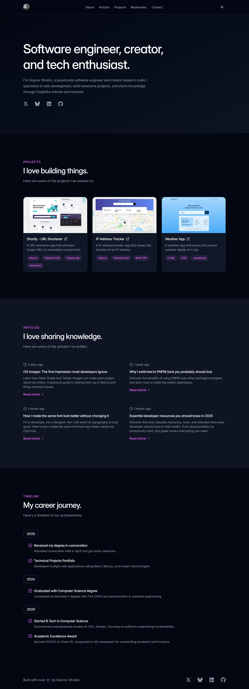

# Portfolio

This portfolio showcases my projects, technical articles written in MDX, and curated development resources. It's designed with a focus on performance, accessibility, and scalability.

## Table of contents

- [Overview](#overview)
  - [The challenge](#the-challenge)
  - [Screenshot](#screenshot)
  - [Links](#links)
- [My process](#my-process)
  - [Built with](#built-with)
  - [What I learned](#what-i-learned)
  - [Continued development](#continued-development)
  - [Useful resources](#useful-resources)
- [Author](#author)
- [Acknowledgments](#acknowledgments)

## Overview

### The challenge

Users should be able to:

- Read technical articles powered by MDX
- Browse a curated list of development bookmarks
- Contact me via a validated, accessible form

### Screenshot

### Links

- Live Site URL: [https://gshukla.vercel.app](https://gshukla.vercel.app)
- Repository URL: [https://github.com/heygauravshukla/portfolio](https://github.com/heygauravshukla/portfolio)

## My process

### Built with

- Semantic JSX markup
- Mobile-first responsive design
- Static Site Generation
- [Next.js 15 (App Router)](https://nextjs.org/)
- [TypeScript](https://www.typescriptlang.org/)
- [Tailwind CSS](https://tailwindcss.com/)
- [Motion](https://motion.dev)
- [MDX](https://mdxjs.com/)
- [EmailJS](https://www.emailjs.com/)
- [pnpm](https://pnpm.io/)

### What I learned

- How to set up MDX in a Next.js project for content
- Adding micro-interactions and subtle animations using the Motion library
- Building reusable components with TypeScript & Tailwind CSS
- Structuring a scalable Next.js project using the App Router

### Continued development

- Add code syntax highlighting
- Automate RSS feed and sitemap

### Useful resources

- [Inter font GitHub repo](https://github.com/rsms/inter) – Resource to download Inter font
- [IBM Plex font GitHub repo](https://github.com/IBM/plex) – Resource to download IBM Plex fonts
- [Squoosh](https://squoosh.app) – Image optimization tool
- [og.new](https://og.new) – Open Graph image generator
- [RedKetchup](https://redketchup.io/favicon-generator) – Favicon Generator

## Author

- Website – [gshukla.vercel.app](https://gshukla.vercel.app)
- GitHub – [@heygauravshukla](https://github.com/heygauravshukla)
- Twitter – [@heygauravshukla](https://twitter.com/heygauravshukla)

## Acknowledgments

The GitHub repository of [Tailwind CSS docs](https://github.com/tailwindlabs/tailwindcss.com) helped me a lot to get insights into how to self-host fonts, and their [Spotlight template](https://tailwindcss.com/plus/templates/spotlight) was the first inspiration for building this site.
