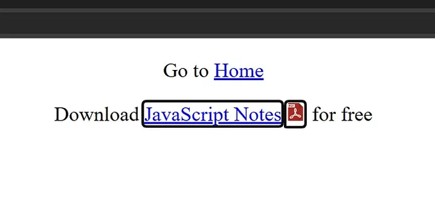

The `content` property in CSS is commonly used when defining text or
images for pseudo-elements like `::before` and `::after`.

Most developers treat pseudo‑elements as purely decorative, but here's
something many don't realize: they are **searchable**, **selectable**, and
**exposed to assistive technologies**.

Yes, a screen reader can announce the value you set in `content`.

## When `content` is an image

Imagine you have a few PDF download links and you want to add a small
PDF icon after each one.


### Using the `::before` pseudo-element

You might write something like this:

```html
<!DOCTYPE html>
<html lang="en">
  <head>
    <meta charset="UTF-8" />
    <meta name="viewport" content="width=device-width, initial-scale=1.0" />
    <title>CSS content property alt text</title>
    <style>
      p {
        text-align: center;
      }

      a[href$=".pdf"] {
        position: relative;
        margin-right: 1.25rem;
      }
      a[href$=".pdf"]::before {
        content: url("/pdf-icon.svg");
        position: absolute;
        left: 100%;
        width: 0.875rem;
        aspect-ratio: 1;
        margin-inline-start: 0.25rem;
      }
    </style>
  </head>

  <body>
    <p>Go to <a href="/">Home</a></p>
    <p>Download <a href="/js-notes.pdf">JavaScript Notes</a> for free</p>
  </body>
</html>
```

Now, when the user navigates with a keyboard and a screen reader announces the focused link, they might hear something like:

> "Graphic JavaScript Notes link"

Strange, right?

The screen reader interprets the pseudo-element image as a generic “graphic.”

#### Fixing it with alt text

```css
content: url("/pdf-icon.svg") / "";
```

Yep, the blank string after the slash acts as the “alt text.”

Now the link gets announced correctly as:

> “JavaScript Notes link”

#### But what if you do want to announce something?

You may expect this to work:

```css
content: url("/pdf-icon.svg") / "PDF";
```

Expecting:

> “JavaScript Notes PDF link”

But instead, screen readers currently announce:

> “PDF graphic JavaScript Notes link”

Weird, but true.

Because of this, using a **blank string** for `::before` with images is usually the best choice to avoid confusing announcements.

### Using the `::after` pseudo-element

Here’s the twist:

With `::after`, screen readers **skip** the image automatically.

So the link is read as:

> “JavaScript Notes link”

No alt text needed.

But if you want it to be announced (e.g., “JavaScript Notes PDF link”), then this works correctly:

```css
&::after {
  content: url("/pdf-icon.svg") / "PDF";
}
```

`::after` behaves much better in this case.

## When `content` is text

You can also control how text-based `content` is announced.

For example, if you want to visually show “A” but have the screen reader announce “PDF,” you can do:

```css
a[href$=".pdf"] {
  &::after {
    content: "A" / "PDF";
  }
}
```

You can even provide:

- a blank string `""` to hide it from assistive tech
- meaningful alt text to override the visible text

Unlike images, **text alt text works consistently for both `::before` and `::after`.**

## Research links

- [Kevin Powell’s YouTube short](https://youtube.com/shorts/3p0dmlAwaRQ?si=K_2GOwAXPkyKMw06)
- [W3C Working Draft](https://www.w3.org/TR/css-content-3/#accessibility)

## Conclusion

You can provide alt text for any type of content used in the CSS `content` property, whether it’s text or images. This lets you:

- visually show one thing,
- announce something different to assistive technology,
- or hide it altogether.

It’s a surprisingly powerful accessibility (a11y) feature that not enough developers know about.

There are plenty of tutorials that teach the basics, but I love sharing the lesser-known tricks that actually make your UI better. If you enjoy these kinds of deep-cut insights, check out my other articles too.

Until next time, goodbye ✌️
